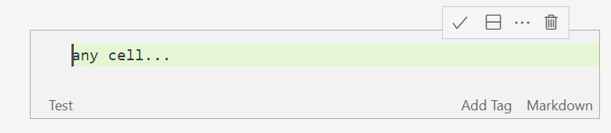

# Jupyter Cell Tags

This vscode extensions enables you to edit Jupyter notebook cell tags.

- Use the `Add Tag` button to add a new tag
- Click on a tag to remove it

The tags are saved in the standard `tags` field inside the cell metadata. 

## Known Issues / Caveats

- the notebook is saved every time a tag changes
- the cells jump into view-mode
- you can only see the tags in edit-mode

## Release Notes

Users appreciate release notes as you update your extension.

### 0.1.0

Initial release

- support for tags

### Next

- Support for arbitrary metadata

